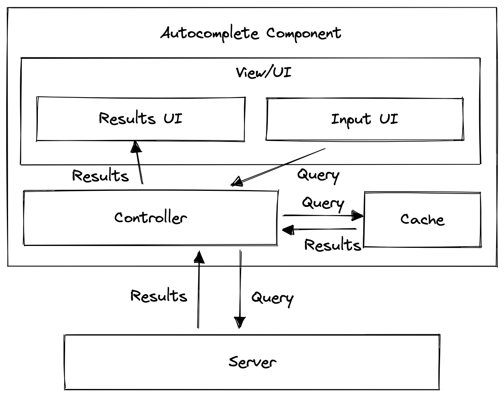

# Autocomplete (Typeahead)

Real life examples:
- Google search bar with mostly text-based suggestions
- Facebook search input with list of rich results

## Requirements
- generic to be used by different apps
- input field UI and search results must be customizable

### Questions to ask
Q: What kind of results should be supported?
A: Any type
Solution: component must accept formatter function for results

Q: What devices will the component be used on?
A: All possible devices
Solution: mobile first approach, media queries for breaking points

Q: Do we need to support fuzzy search?
A: Yes

### Architecture


Input field UI: handles user input
Results UI (rendered in Popup): displays results to the user
Cache: stores results of previous queries 
Controller: handles interaction with cache, API, input field and results popup


### Data Model:
Input field:
- current search string
Results UI:
- fields to display
Controller:
- props/options exposed via component API
- current search string
Cache:
- initial results
- cached results


### React Implementation
<Autocomplete />

##### Props definition:

###### Basic:
- **resultNumber**: number of results to show in the list
- **eventListeners**:
    - onFocus
    - onBlur
    - onChange
    - onSelect

###### Optimization:
- **minimumQuery** with default: trigger the search only once typed like 3 chars
- **debounceDuration** with default: to avoid triggering API request for each keystroke 
- **apiTimeoutDuration** with default: how long before displaying an error
- **errorMessage** with default: error message to display
- **dataSource**: network/cache/cache-only
- **cacheDuration** with default: how long to keep each cache entry (requires adding timestamp and `setInterval` task)

###### Customized rendering:
Options:
- Theming options object ({textSize: '12px', textColor: 'red'}). Easiest but the least customizable
- Classnames with support of multiple classnames eg. {input: 'custom-input', popup: 'custom-popup'}. Easy but can have styling conflicts
- Render functions. Inversion of control technique. The most flexible approach but requires most work from consuming developer.
  - **renderInput**: function to render custom input, if not provided default input will be rendered
  - **renderResult**: function to render result item, if not provided default result item will be rendered

Solution:
- if component is part of UI Library, will go with render functions
- if component is part of corporate UI library, would combine theming  render functions could to ensure consistency and flexibility

##### API handling:
- **sendRequest**: function to handle request (to support different API other than REST, for example, GraphQL). Function must accept `query`, `limit` and `pagination` args.
or
- **apiURL**: api url to send GET request

### Deep Dive
#### Network
##### Handling concurrent requests/race conditions (in case of multiple pending requests)
Options:
- Attach a timestamp to each request to determine the latest. Discard responses of irrelevant queries or put them into cache
- Save results to an object map {[query]: results}

Pick: cache-based solution

##### Failed requests and retries

Component can automatically retry firing the query (with exponential backoff strategy)

##### Offline Usage
- Give indication it is offline
- Could read purely from cache
- Avoid firing requests

#### Cache
Performance vs memory considerations

##### Cache Structure Options
###### Hashmap i.e. {query: [results]}

Pros: 
- easy to implement
- O(1) retrieving complexity

Cons:
- duplicate results
- memory concerns

###### List of results as [results]

Pros:
- not much of duplicate results

Cons:
- O(n) for retrieving complexity
- Might be blocking UI

Best for:
- short-lived websites like Google search

##### Normalized map of results
Database-like structure.
```javascript
const results = {
    1: {id: 1, value: 'facebook', timestamp: '2024-06-23 13:30:03'},
    2: {id: 2, value: 'fanthom',  timestamp: '2024-06-23 13:33:03'},
    3: {id: 3, value: 'another',  timestamp: '2024-06-23 13:35:03'}
}

const cache = {
    'fa': [1, 2],
    'ano': [3],
    'another': [3],
}
```
Pros:
- fast lookup and non-duplicated data

Cons:
- processing costs to combine results

Best for:
- Long-lived applications

#### Initial results
- popular search queries
- historical searches
- current data

#### Caching strategy
- Memory vs processing speed
- Be mindful of stale cache


#### Performance
- Loading speed (use cache where possible before displaying fresh results)
- debouncing/throttling
- memory usage (reasonable cache management)
- virtualized lists for results

#### User Experience
- Autofocus
- Handle different states (loading, error, no network, success)
- Handling long strings (truncations and ellipsis with hover, `title` attribute)
- Mobile friendliness: UI large enough, `autocapitalize: off`, `autocomplete: off`, `autocorrect: off`, `spellcheck: false`

#### Accessibility
- Keyboard interaction: Submit on Enter, focus out on Escape, navigating with arrows on the results list, setup `tabIndex`
- use semantic HTML tags or `aria` roles
- use `<ul>` and `<li>` or use `role="lisbox"` and `role="option"`
- `role="combobox` for the `input`
- `aria-haspopup` for the container
- `aria-expanded` to indicate whether popup is shown
- `aria-live` for the popup to notify screen readers when new results are added
- `aria-autocomplete` for the container


- 

